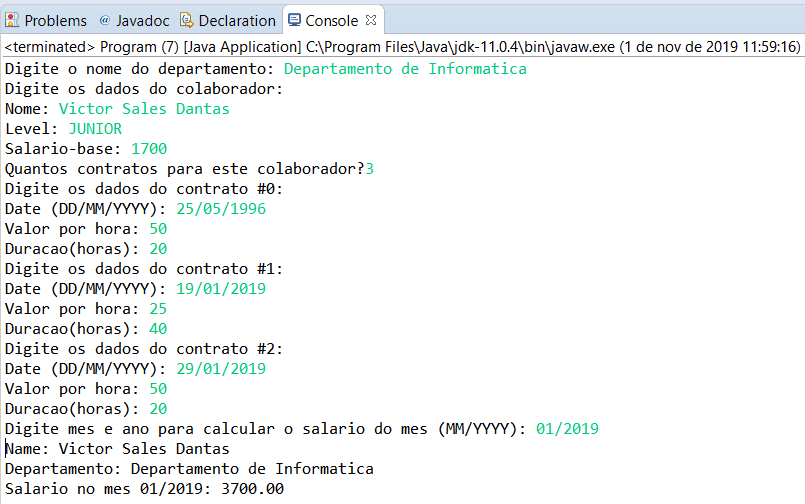

# curso-java-Worker

Códigos do curso online de java avançado na Udemy(https://www.udemy.com/share/1013hwA0cfdVlTQn4=/)

Neste exercicio foi feito um exemplo mais robusto de composicao, usando uma classe Worker representando um colaborador ou o servidor de uma empresa, em que ele tem uma outra classe departamento, e uma lista de contratos, que eh outra classe tambem. O programa pede os dados do colaborador, em seguida pede o numero de contratos que se deseja acrescentar para retornar o calculo final do seu salario baseado no mes passado como parametro, para saber quanto ele ganhou naquele mes, dependendo dos contratos que ele recebeu naquele mesmo mes, como mostra o  exemplo a seguir:

